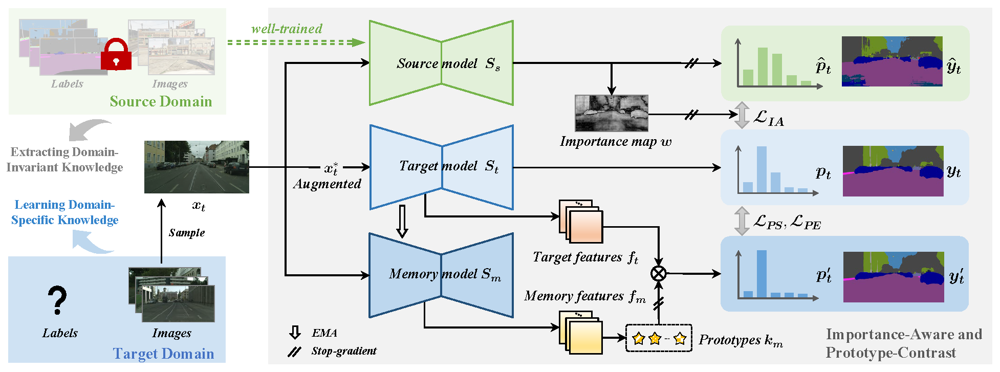

# IAPC 

## <p align="center">Towards Source-free Domain Adaptive Semantic Segmentation via Importance-aware and Prototype-contrast Learning
  
<div align="center">
 
[Paper]()
  

 
 </div>
 
 Code for our paper "Towards Source-free Domain Adaptive Semantic Segmentation via Importance-aware and Prototype-contrast Learning"
 
In this paper, we propose an end-to-end source-free domain adaptation semantic segmentation method via Importance-Aware and Prototype-Contrast (IAPC) learning. The proposed IAPC framework effectively extracts domain-invariant knowledge from the well-trained source model and learns domain-specific knowledge from the unlabeled target domain.


## Code

### List
-  <a href="https://github.com/yihong-97/Source-free_IAPC/tree/fd356c1a2c17bea082ca0fb9e85c87724fe7d1b7/GTA5" target="_blank">Code</a>
-  <a href="https://drive.google.com/drive/folders/1OWXlABtiIs4JQISjxzOY31e1ZBzniylt?usp=sharing" target="_blank">Checkpoints and prediction maps</a>

### Prerequisites
The code is implemented with Python(3.6) and Pytorch(1.7).

### Datasets
- Download  <a href="https://www.cityscapes-dataset.com/" target="_blank">Cityscapes datasets</a>

### Training
```
python generate_plabel_cityscapes.py
python train.py
```
### Testing
```
python evaluate_cityscapes.py
```

## Results
<div align="left">
<table>
  <tr>
      <td></td> 
      <th>Model</th> 
      <th>mIoU</th> 
      <th>mIoU*</th>
  </tr>
  <tr>
      <td rowspan="2">GTA5-to-Cityscapes</td>    
      <td ><a href="https://drive.google.com/file/d/10aT2amgx8mY3XpCCIZ9TDbnVWsN7vn1x/view?usp=sharing" target="_blank">Source Only</a></td>  
      <td >36.6</td> 
      <td >-</td>  
   </tr>
   <tr>
      <td ><a href="https://drive.google.com/file/d/12P43VlJpduyJW1-F_GDH1FSyF98sWrb6/view?usp=sharing" target="_blank">IAPC</a></td> 
      <td >49.4</td> 
      <td >-</td>
   </tr>
   <tr>
      <td rowspan="2">Synthia-to-Cityscapes</td>    
      <td ><a href="https://drive.google.com/file/d/1p2g8r4zlaPi9YgnIlzPy07XU5k0JRBrN/view?usp=sharing" target="_blank">Source Only</a></td>  
      <td >35.2</td> 
      <td >40.5</td>  
   </tr>
   <tr>
      <td ><a href="https://drive.google.com/file/d/1j_TRVYErc5EVwJz6W5jNbR5Tx2Y8X2VG/view?usp=sharing" target="_blank">IAPC</a></td> 
      <td >45.3</td> 
      <td >52.6</td>
   </tr>
</table>
   </div>
